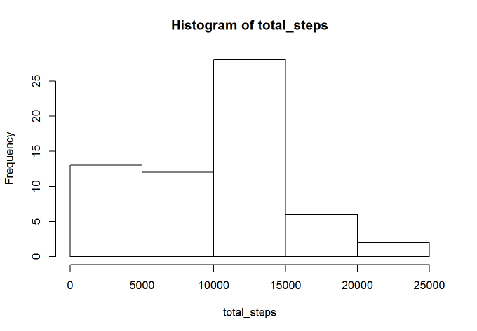
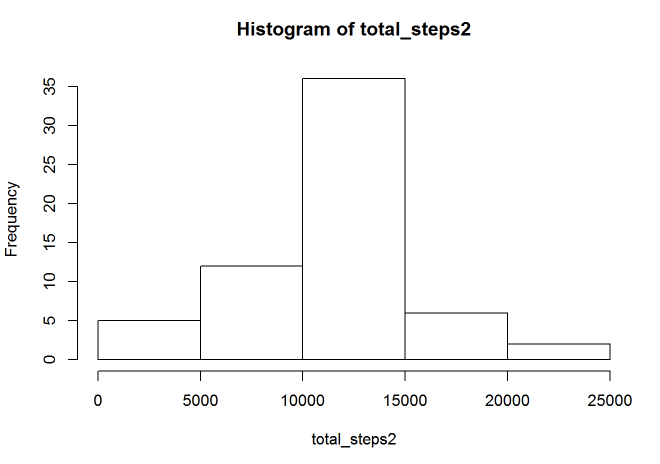
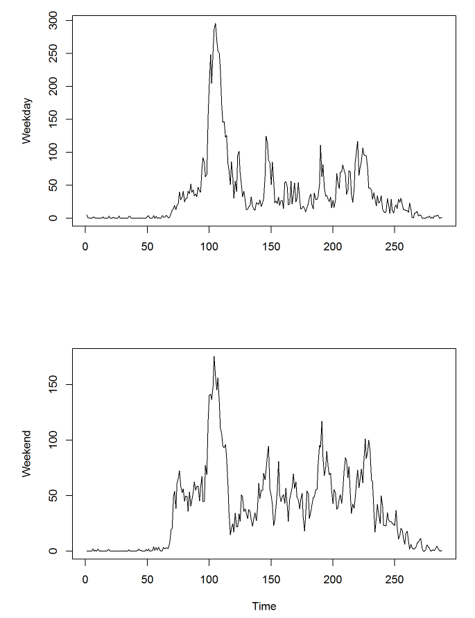

## Loading and preprocessing the data

The first step is to load the data:


```r
data <- read.csv('activity.csv')
```

## What is mean total number of steps taken per day?

Next we are going to calculate the total number of steps taken per day. For this we split the steps based on the date and then apply the sum function on it together with removal of NA values. Then we illustrate its histogram:


```r
total_steps <- sapply(split(data$steps,data$date),FUN = (function(X) sum(X,na.rm = TRUE)))
hist(total_steps)
```



For the last thing in this part we compute the mean and the median of total_steps:


```r
mean(total_steps)
```

```
## [1] 9354.23
```

```r
median(total_steps)
```

```
## [1] 10395
```

## What is the average daily activity pattern?
Now we make a time series plot of the 5-minute interval (x-axis) and the average number of steps taken, averaged across all days. For this purpose we first split the steps by intervals and after applying mean function to it convert it to to time series using r function `ts()`:


```r
intervals_mean <- sapply(split(data$steps,data$interval),FUN = (function(X) mean(X,na.rm = TRUE)))
interval_time_series <- ts(intervals_mean)
plot(interval_time_series)
```


As is obvious from the plot in 5-minute interval, on average across all the days in the dataset, 101th interval has the maximum number of steps.

## Imputing missing values

And now for imputing the NAs with meaning full values! First let's check how many NA's we have in each column:


```r
lapply(data,FUN = (function(X) sum(is.na(X))))
```

```
## $steps
## [1] 2304
## 
## $date
## [1] 0
## 
## $interval
## [1] 0
```

For imputing we are going to replace NAs with the mean of each intervals which was stored in intervals_mean in the previous part:


```r
data2 <-data.frame(data)
for (i in 1:nrow(data)){
     if (is.na(data[i,'steps']))
          data2[i,'steps']<-intervals_mean[as.character(data[i,'interval'])]
}
```

Now lets do the same steps done in part 2:


```r
total_steps2 <- sapply(split(data2$steps,data2$date),sum)
hist(total_steps2)
```



```r
total_steps_mean2 <- mean(total_steps2)
total_steps_median2 <- median(total_steps2)
total_steps_mean2
```

```
## [1] 10766.19
```

```r
total_steps_median2
```

```
## [1] 10766.19
```

As is obvious from the results the output from data2 is not significantly different from data due to the fact that we use mean technique for imputing.


## Are there differences in activity patterns between weekdays and weekends?
For answering this question a few processing should be carried. First we are going to find all the dates that are weekdays by converting the date column in date2 to `Data` and then getting their actual days in the week and check if they are weekdays or not.
The result would be a boolean vector which each of its element is 1 if the corresponding date is a weekday and zero otherwise:


```r
weekday_index <- weekdays(as.Date(data2$date,'%Y-%d-%m')) %in% c('Monday', 'Tuesday', 'Wednesday', 'Thursday', 'Friday')
```

Now we subset the data based on the weekday_index and plot each of them individually similar to steps in part 3:


```r
weekday_data <- data2[weekday_index,]
weekend_data <- data2[!(weekday_index),]
intervals_mean_weekday <- sapply(split(weekday_data$steps,weekday_data$interval),FUN = (function(X) mean(X,na.rm = TRUE)))
interval_time_series_weekday <- ts(intervals_mean_weekday)
intervals_mean_weekend <- sapply(split(weekend_data$steps,weekend_data$interval),FUN = (function(X) mean(X,na.rm = TRUE)))
interval_time_series_weekend <- ts(intervals_mean_weekend)
par(mfrow=c(2,1))
plot(ts(interval_time_series_weekday),ylab='Weekday',xlab='')
plot(ts(interval_time_series_weekend),ylab='Weekend')
```



As is apparent from the charts the patterns are quite the same but in some intervals the mean of weekends are higher.
